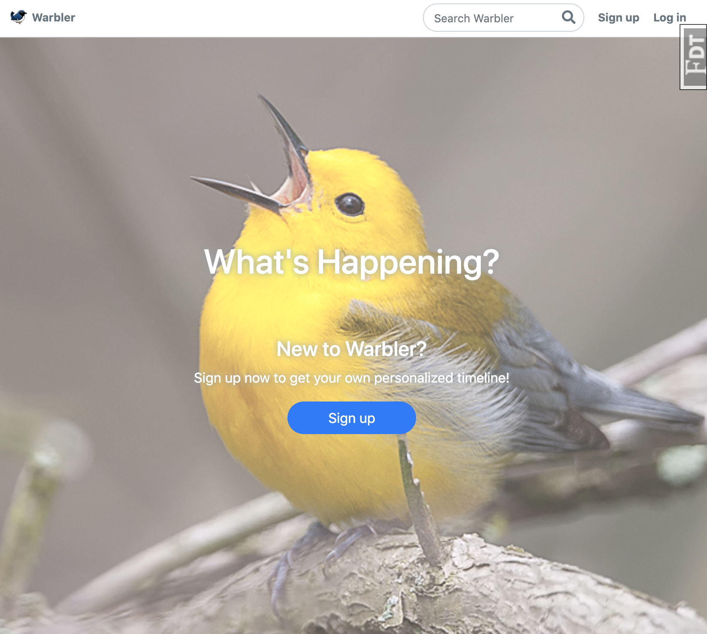
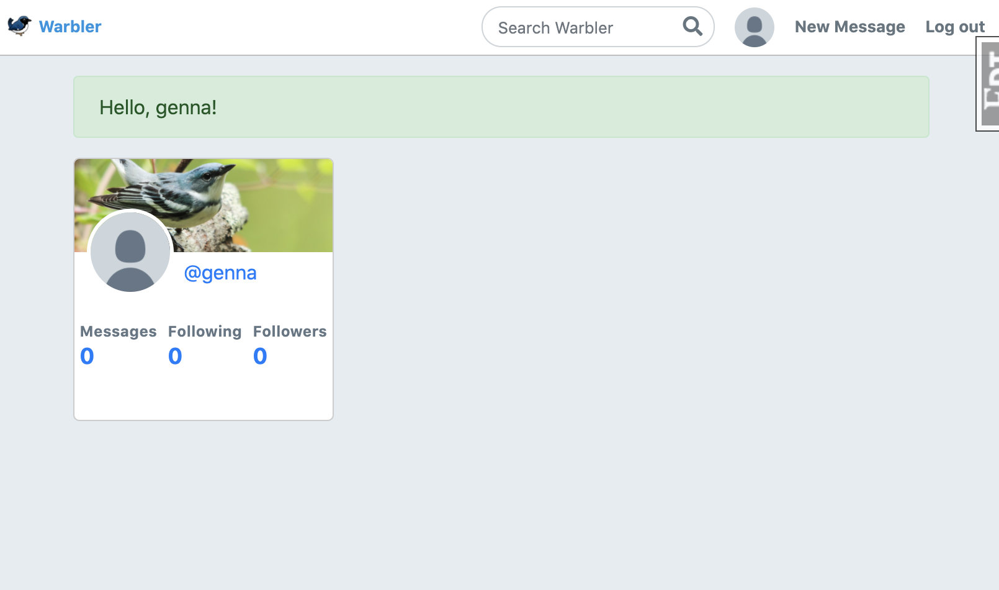
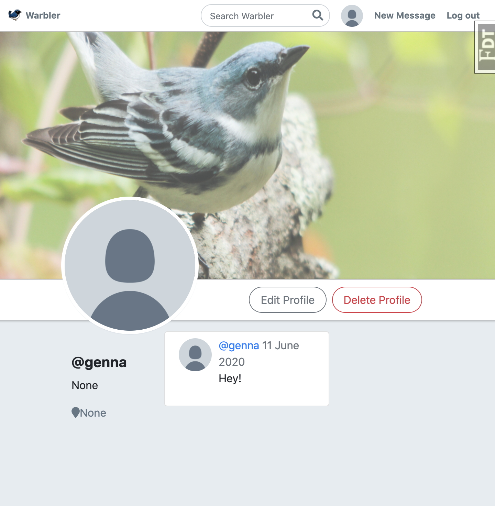

## Getting started with Warbler
1. Clone this repository and cd into it
2. Create a Virtual Environment `python3 -m venv venv`
3. Activate your virtual environment`source venv/bin/activate`
4. install all depencies to run this application `pip install -r requirements.txt`

## Warbler
A twitter clone application

LoginPage

Home page

Profile

